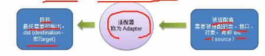
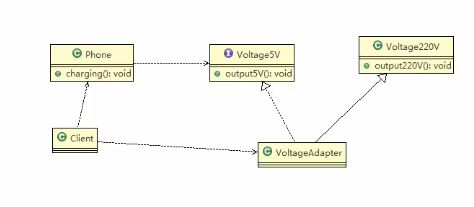
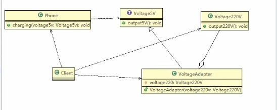
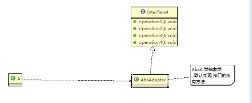
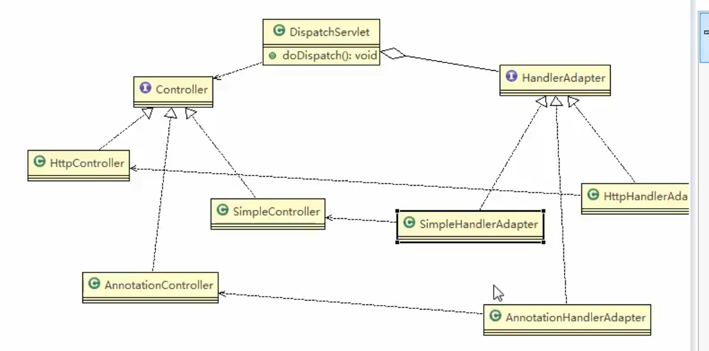

#### 适配器模式

##### 基本介绍
* 适配器模式（Adapter Pattern）:将某个类的接口转化为客户端期望的另一个接口表示，主要目的是兼容性，让原本因接口不匹配不能在一起工作的两个类协同工作，别名为包装类（Wrapper）。
* 适配器模式属于结构型模式。
* 主要分为三类：类适配器模式、对象适配器模式、接口适配器模式。

##### 1、类适配器模式

##### 2、对象适配器模式

  
######  对象适配器模式注意事项
    (1)根据合成复用原则，使用组合代替继承，解决了类适配器必须继承Src类的局限性问题，也不在要求dst必须是接口。
    (2)使用成本更低、更灵活。
##### 3、接口适配器模式

####### 接口适配器模式注意事项
    (1)当不需要全部实现接口提供的方法时，可预先设计一个抽象接口，并为该接口中的每一个方法提供一个默认的实现（空方法），那么抽象的子类可有选择的覆盖父类的某些方法来实现需求。
    (2)适用于一个接口不想使用所有方法的情况。

##### Spring MVC 中使用的适配器模式(DispatchServlet)
