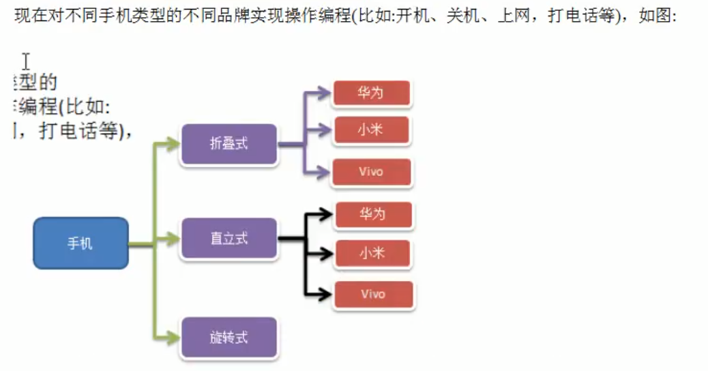
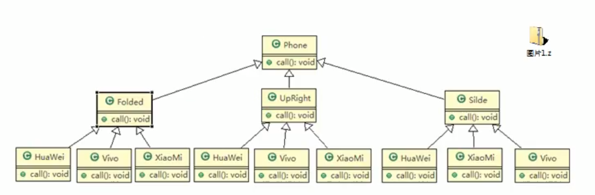
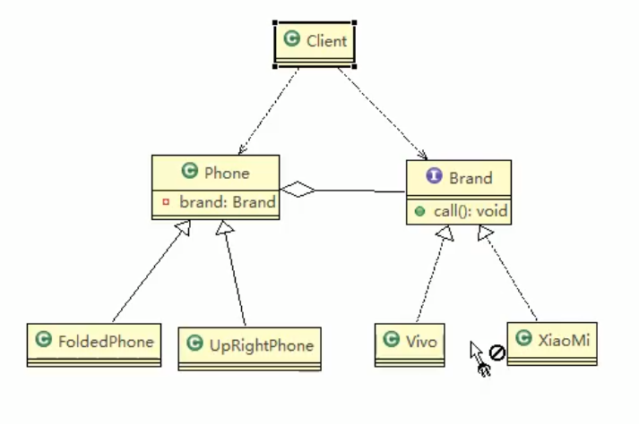

#### 桥接模式
###### 应用背景

###### 传统方案解决手机操作问题

##### 桥接模式基本介绍
    (1)桥接模式是指：将实现和抽象放在两个不同的层次中，使得两个层次可以独立改变。
    (2)是一种结构型设计模式。
    (3)Bridge模式是基于类的最小设计原则，通过使用封装、聚合以及继承等行为让不同的类承担不同的职责。它主要特点是把抽象与行为实现分离开来，从而保证各部分的独立性以及应对他们的功能扩展。
    (4)桥接模式要求正确识别出系统中两个独立变化的维度（抽象与实现），因此使用范围有一定的局限性。
###### 使用桥接模式实现UML类图

