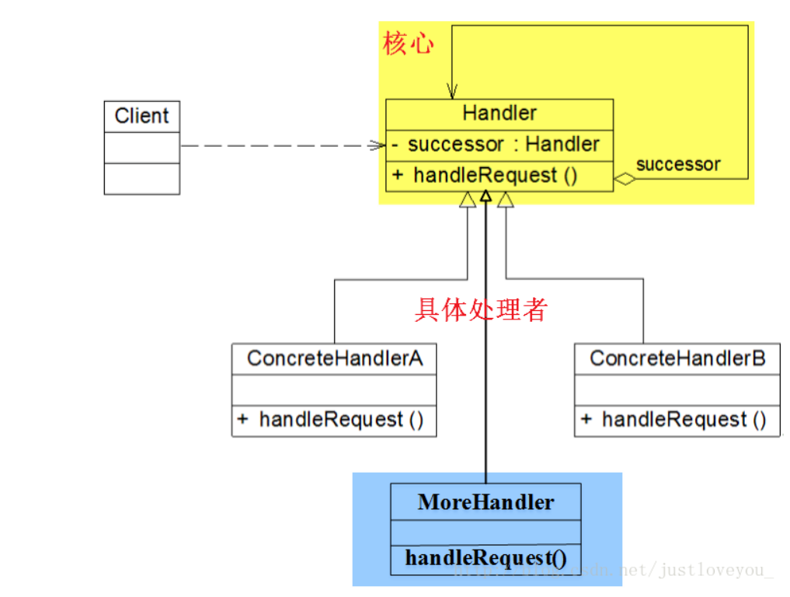
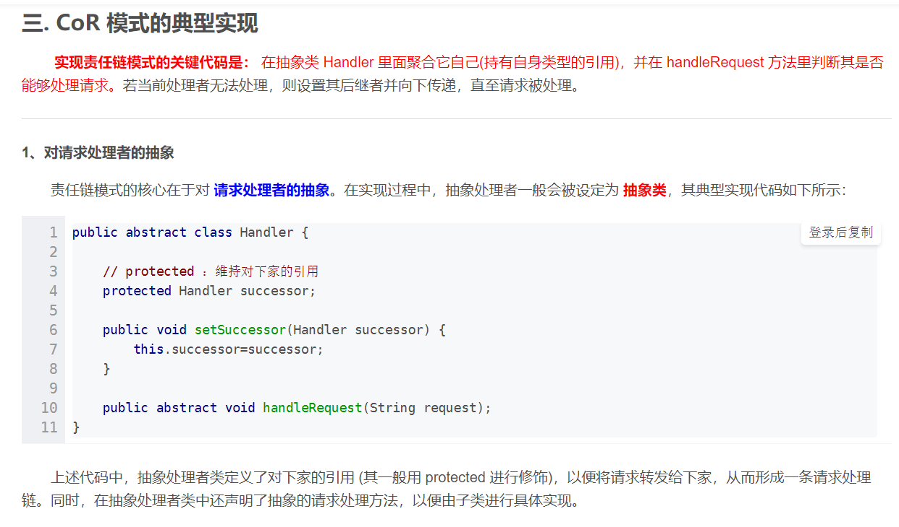
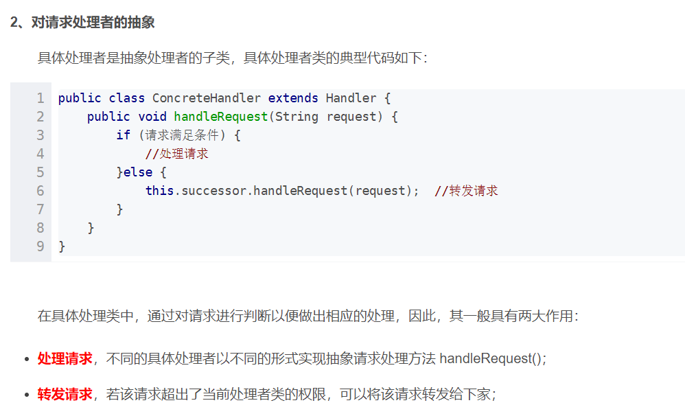
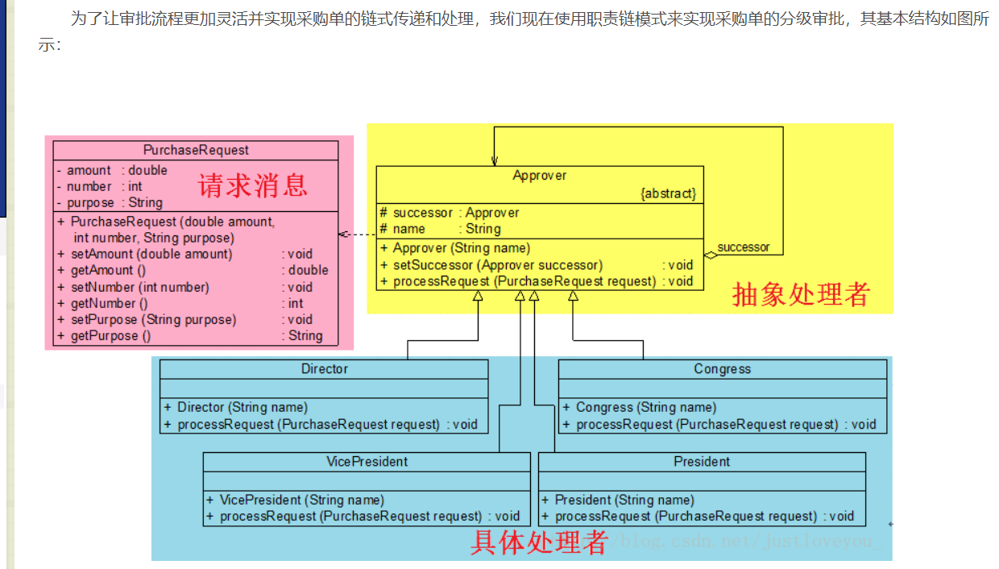
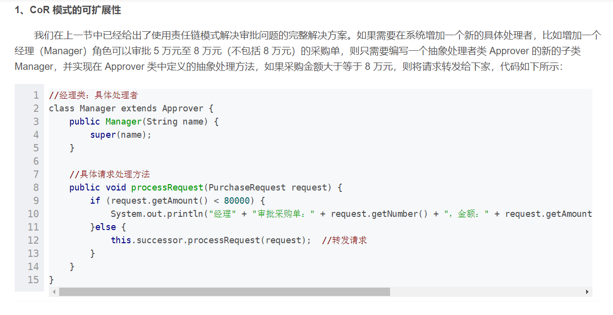

#### 责任链模式(Chain Of Responsibility)

##### 理解链的概念

* 1、链是一些列节点的集合,在责任链中,节点实质上是指 **请求的处理者**。
* 2、链的各节点可拆分、可重组，在责任链中，实质上是 **请求发送者** 与 **请求处理者** 的解耦。

##### COR模式定义与结构

> 责任链模式：指用一系列类(Classes)去处理一个请求，这些类之间是一个松散耦合，它们之间唯一的联系就是它们之间传递的Request，即就是当接受到一个请求
> 时，A类先处理，若A类处理不了，就传递到B类处理，若B类处理不了，就传递到C类处理，这些请求处理类就像一个链条(Chain)一样，请求在这条链上不断的传递下去，
> 直到被处理为止。

`定义`

> 使多个对象都有机会处理请求，从而避免请求的发送者和请求的处理者耦合在一起，将这些对象连接成一条链，并沿着这条链一直传递请求，知道有对象处理它为止。

`类型`

> 对象行为型模式

`实质`

> 责任链上的处理者负责处理请求，客户只需要将请求发送到链上即可，无需关心请求的处理细节和请求的传递，从而实现请求发送者与请求处理者的解耦。

`责任链模式结构类图`

  

> 从责任链模式的结构类图中可以发现，具体的处理者可以有多个，并且所有请求处理者均实现相同的抽象接口。

###### 角色分析
> 1、Handler(抽象处理者)：处理请求的接口，一般设计为具有抽象请求处理方法的抽象类，以便于不同具体处理者进行继承或实现，从而实现具体的请求处理方法，
> 此外由于每一个请求处理者的下家还是一个处理者，因此抽象处理者本身还包含了一个本身的引用(successor)，作为其对下家的引用，以便处理者链成一条链；

> 2、ConcreteHandler(具体处理者)：抽象处理者的子类，用来处理用的请求，其实现了抽象处理者定义的请求处理方法，在具体处理请求时，判断是否有相应的处理
> 权限，如果有就处理它，否则其将请求转发给后继者，以便让后面的处理者继续处理。
 
> 3、在责任链模式中，由于每个请求处理者对下家的引用链成了一条链，该请求会在链上一直传递下去，直到链上的某个请求处理者能够处理该请求， **事实上，客户
> 端发出的请求并不直到链上哪个请求处理者会处理该请求，这使得系统在不影响客户端的使用下动态的重新组织链和分配责任。**

##### COR模式的典型实现

##### COR模式应用实例

##### COR模式灵活性

##### COR模式优点
> 降低了耦合度，使得请求发送者和请求处理者解耦，便于灵活的、可插拔的定义请求处理过程；

> 简化并封装了请求过程，而且这个过程对客户端来说是透明的，以便于动态的重新组织链或分配链，增强请求处理的灵活性。

> 在上面的示例中，这两个优点主要体现为如下两点：第一，我们可以随时改变内部的请求处理规则，每个请求处理者都可以去动态地指定他的继任者。也就是说，主任
> 完全可以跳过副董事长直接找到董事长进行审批。第二，我们可以从职责链任何一个节点开始，即如果主任不在，可以直接去找副董事长，责任链还会继续，不会有任何影响。

##### COR模式类型区分
> 责任链模式分为纯责任链模式和不纯责任链模式

###### 纯责任链模式
> 纯责任链模式：要求请求处理者只能在两个行为中选择一个去处理，即就是，要么全部承担，要门将责任全部推给下家，不允许出现某一个具体处理者对象在承担了一部
> 分或全部责任后又将责任继续向下传递，而且在纯的责任链模式中，要求请求必须被某个处理者对象接受，不能出现某个请求未被任何处理者处理的情况。

###### 不纯责任链模式
> 不纯责任链模式: 允许某个请求被一个具体处理者部分处理之后再向下传递，或者一个具体处理者处理完请求之后继续让后继处理者继续处理该请求。而且一个请求可以
> 最终不被任何处理者对象所接收。

