#### 代理模式

##### 基本介绍
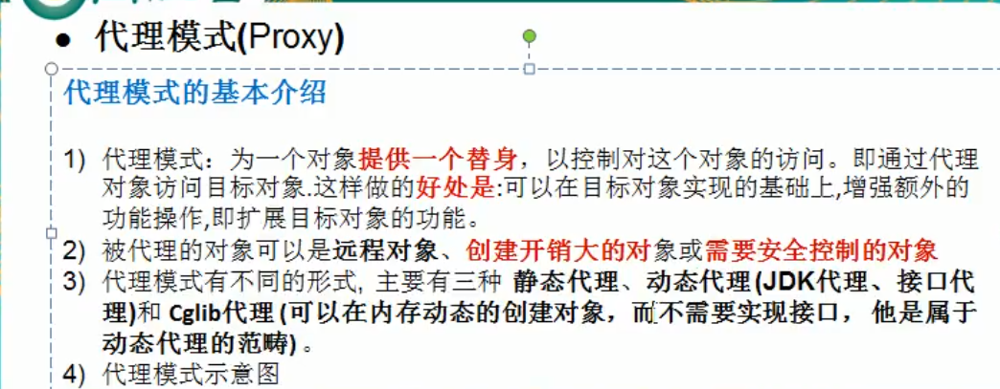

##### 类图分析
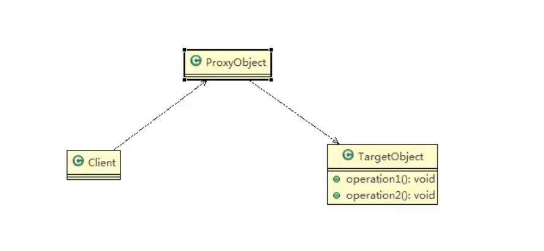

##### 静态代理
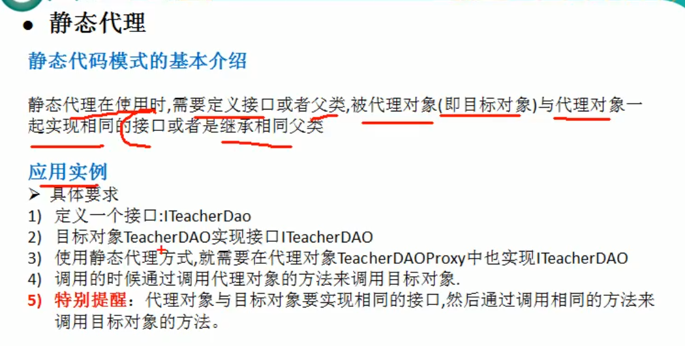

##### 静态代理类图分析
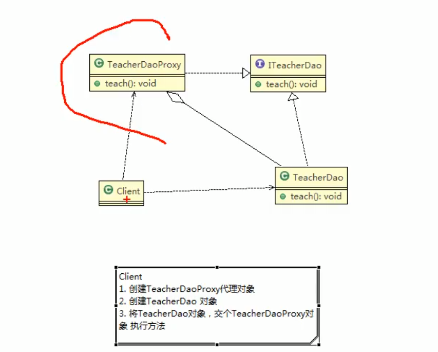

##### 静态代理优缺点分析
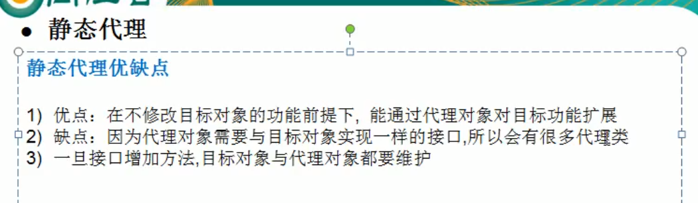

##### 动态代理
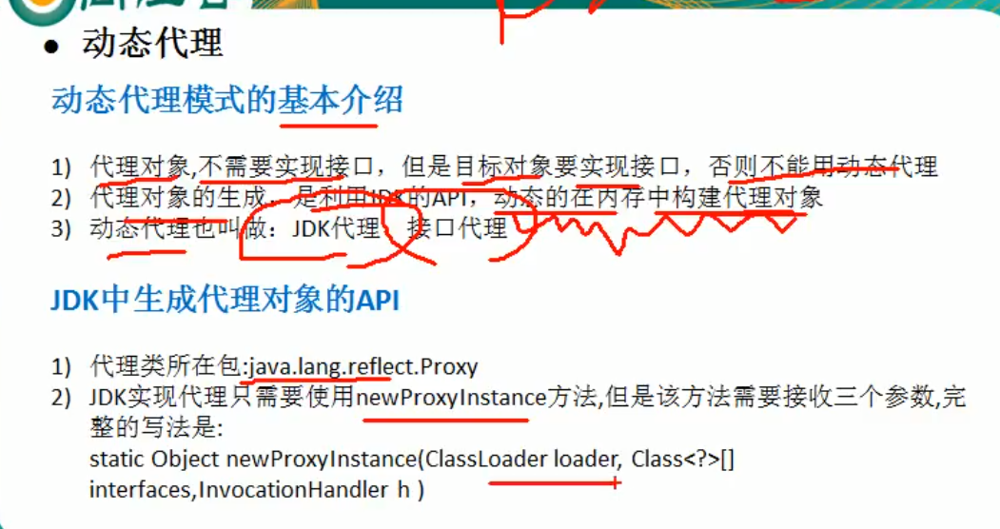

##### 动态代理之JDK代理类图分析
> 实际上代理类也相当于实现了接口(例如：Subject)，然后通过反射对被代理对象进行功能上的增强。

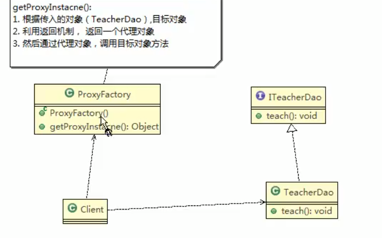

##### 部分API分析
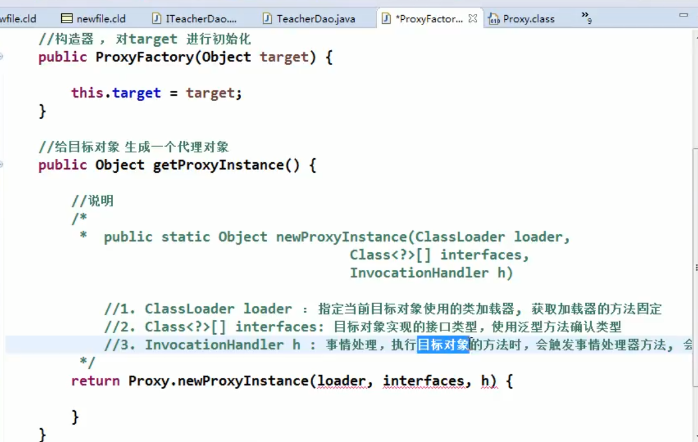
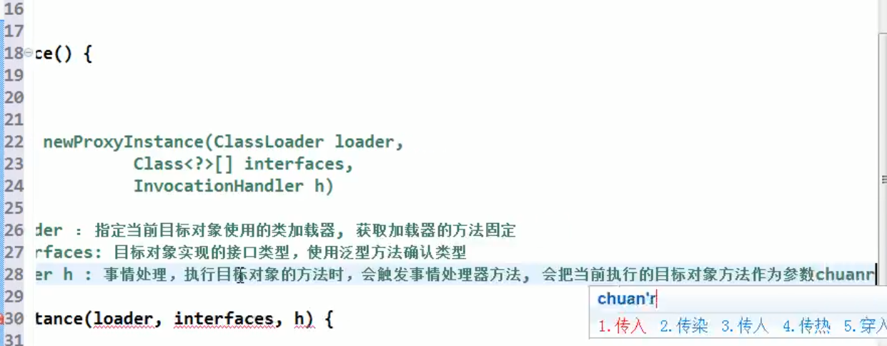
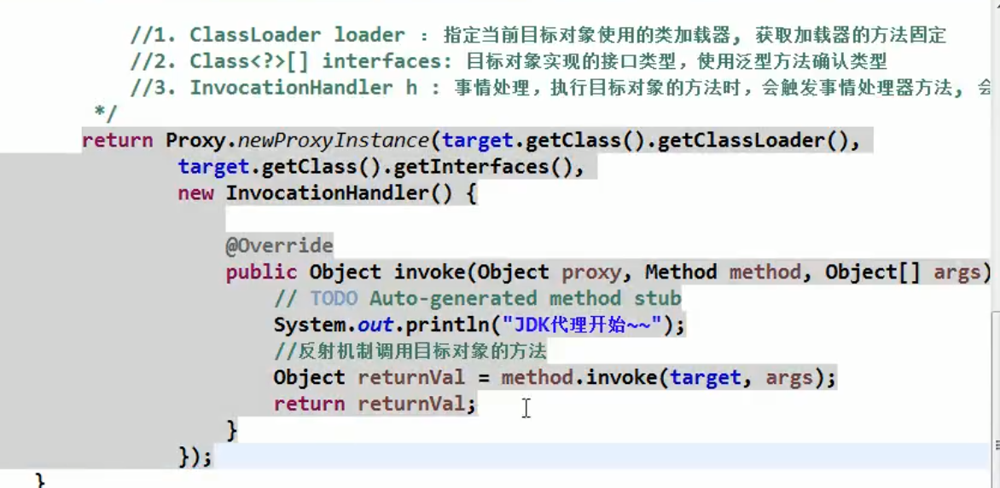

##### 动态代理之Cglib代理
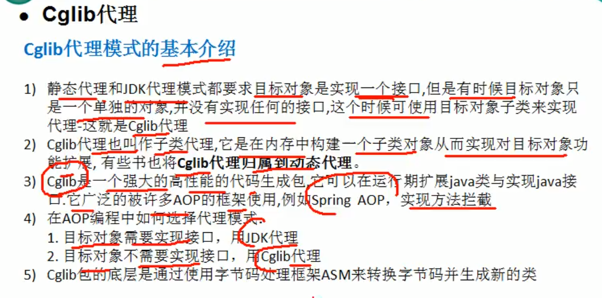
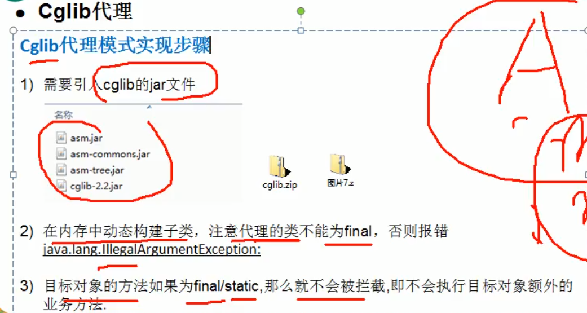

##### Cglib代理之类图分析
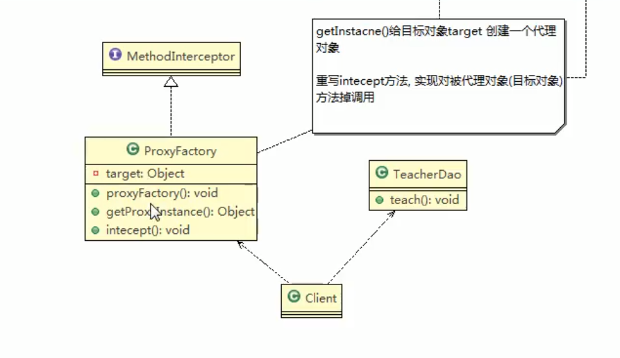

##### 部分代码分析
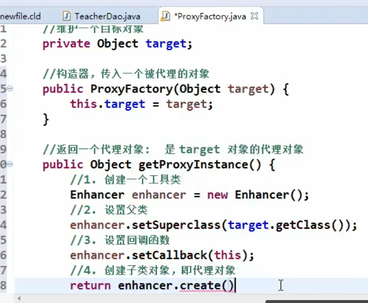
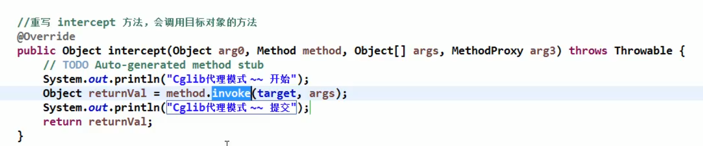

##### 代理模式（Proxy）的变体
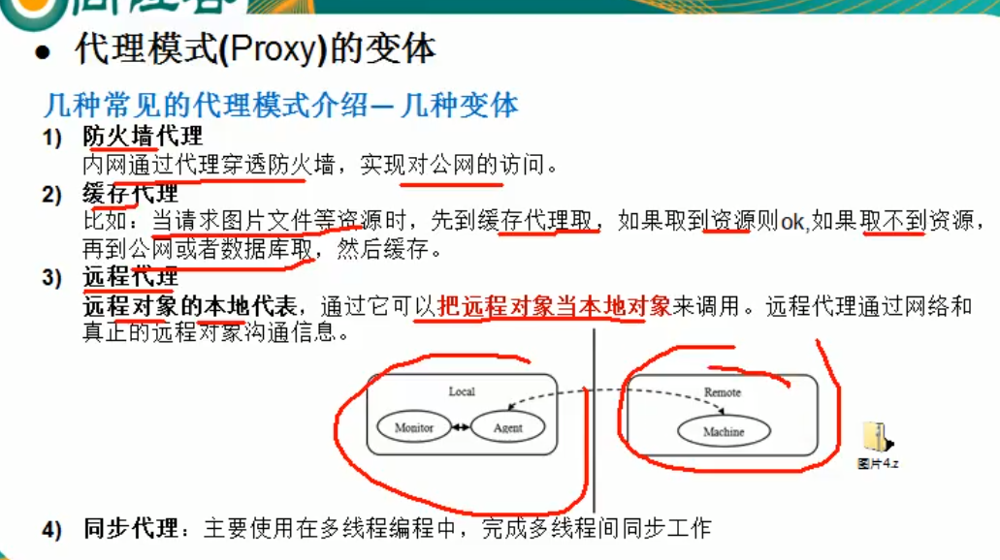