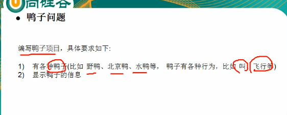
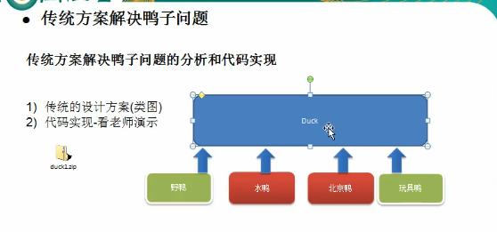
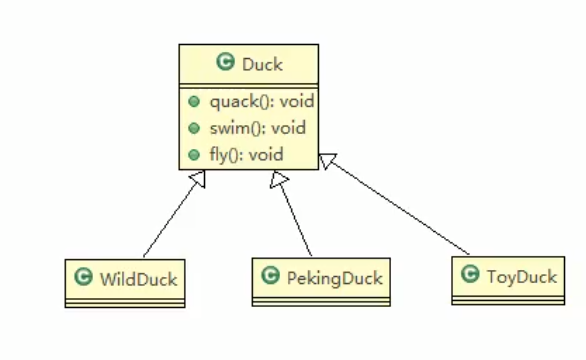
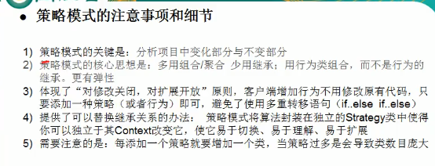

#### 策略模式

##### 背景描述

##### 策略模式角色涉及分析
> 应用场景如下：刘备要到江东娶老婆了，走之前诸葛亮给赵云三个锦囊妙计，说是按天机拆开能解决棘手问题。场景中出现三个要素：三个妙计（具体策略类）、一个锦囊（环境类）、赵云（调用者）。

* 环境类(Context): 用来操作策略的上下文环境(维护Strategy对象的引用，可以定义接口用来访问Strategy的具体实现)。
* 抽象策略类(Strategy): 策略的抽象(定义所有支持的算法的公共接口)。
* 具体策略类(ConcreteStrategy):具体的策略实现(实现Strategy接口的具体实现者)。

##### 注意事项

