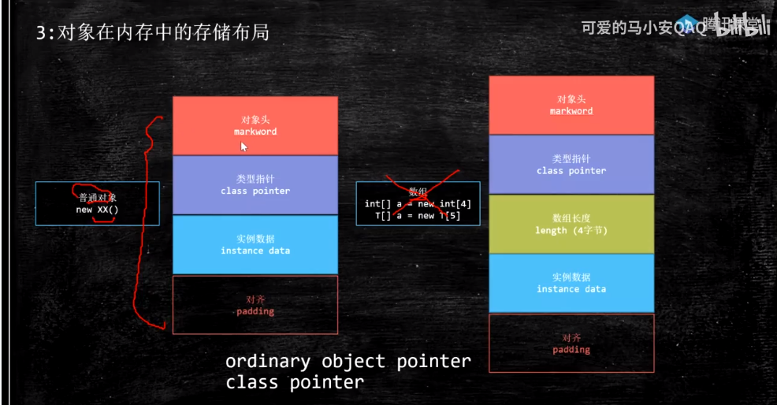

# 多线程学习(通过CAS引入学习多线程)

### 1、CAS原理(Compare And Swap)

* 例如：java.util.concurrent.atomic包下的AtomicInteger类
* ABA问题指的是：其他线程修改数次最后值和原值相同!!!,解决方案是给当前值增加一个版本号，当每个线程进行修改时，版本号同时累加。
* 情况1：从读取当前值E开始，计算结果值V，比较E==V,那么直接更新新的值为V;
* 情况2：从读取当前值E开始，计算结果值V，比较E!=V，(步骤2:那么需要重新获取最新E值，再计算结果值V，再次进行比较)，若仍E!=V，那么继续执行步骤2，直到
E==V时，更新最新值V值。

### java底层实现 Unsafe类

* 最终实现执行的是: lock cmpxchg 指令

### 2、Java 对象在内存中的存储布局

* 知识点: markword 一般都是12个字节
* 知识点: Class Pointer 默认开启指针压缩的情况下4个字节;关闭的情况下8个字节;
* 知识点: padding对齐 当不能被8整除时，默认填充值，直到可以被8整除为止。

### 3、锁的升级(markword)
> NEW - 偏向锁 - 轻量级锁(无锁、自旋锁、自适应锁) - 重量级锁

##### 重量级锁
> 重量级锁中存在一个锁队列，且该队列是处于一个wait状态。

##### markword记录了哪些信息?
> 1、锁的状态信息  

> 2、GC标记信息

> 3、分代年龄

### 锁降级(不重要)

### 锁消除

### 

### JVM 包含了哪些垃圾回收器
* 由于JVM的分代年龄只占用了4bit,最大值为15 = (8 + 4 + 2 + 1)

