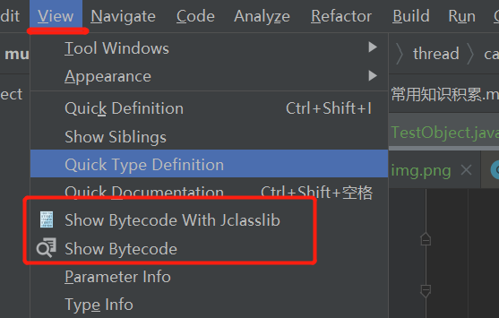

### 安装插件 ByteCode Viewer



#### 在增加synchronized关键字之后，主要代码为
```` 
0 new #2 <com/gaogba/thread/entity/User>
3 dup
4 invokespecial #3 <com/gaogba/thread/entity/User.<init>>
7 astore_1
8 getstatic #4 <java/lang/System.out>
11 aload_1
12 invokestatic #5 <org/openjdk/jol/info/ClassLayout.parseInstance>
15 invokevirtual #6 <org/openjdk/jol/info/ClassLayout.toPrintable>
18 invokevirtual #7 <java/io/PrintStream.println>
21 aload_1
22 dup
23 astore_2
24 monitorenter // synchronized关键字主要是这块代码生效，[类似于监视器]开始....
25 getstatic #4 <java/lang/System.out>
28 aload_1
29 invokestatic #5 <org/openjdk/jol/info/ClassLayout.parseInstance>
32 invokevirtual #6 <org/openjdk/jol/info/ClassLayout.toPrintable>
35 invokevirtual #7 <java/io/PrintStream.println>
38 aload_2
39 monitorexit  // synchronized关键字.....结束
40 goto 48 (+8)
43 astore_3
44 aload_2
45 monitorexit
46 aload_3
47 athrow
48 return
````

#### 没有加synchronized关键字情况下，类字节码文件主要代码为
````
 0 new #2 <com/gaogba/thread/entity/User>
 3 dup
 4 invokespecial #3 <com/gaogba/thread/entity/User.<init>>
 7 astore_1
 8 getstatic #4 <java/lang/System.out>
11 aload_1
12 invokestatic #5 <org/openjdk/jol/info/ClassLayout.parseInstance>
15 invokevirtual #6 <org/openjdk/jol/info/ClassLayout.toPrintable>
18 invokevirtual #7 <java/io/PrintStream.println>
21 return
````

#### 因此synchronized的底层实现
* 1、给关键代码增加synchronized锁
* 2、monitorenter 到 monitorexit
* 3、执行过程锁自动升级(无锁->偏向锁->轻量级锁->重量级锁)
* 4、lock comxchg 指令