### Volatile原理实现

* 1、保证线程的可见性
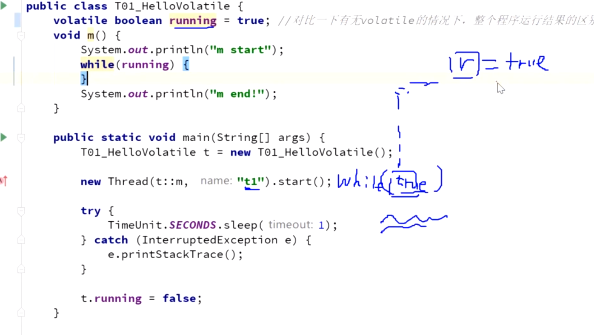
  
* 2、禁止指令重排

> CPU 的乱序执行
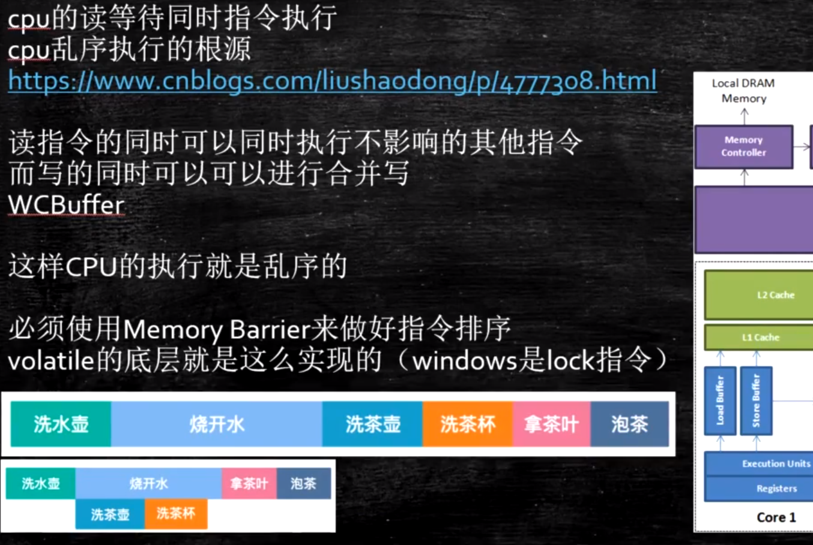

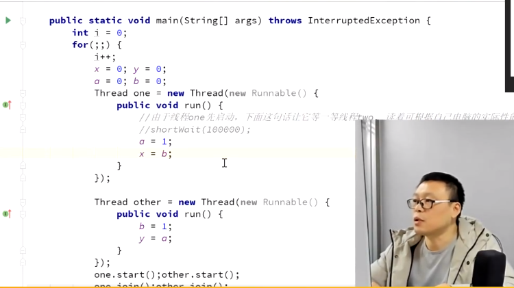

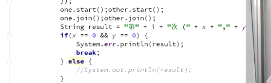

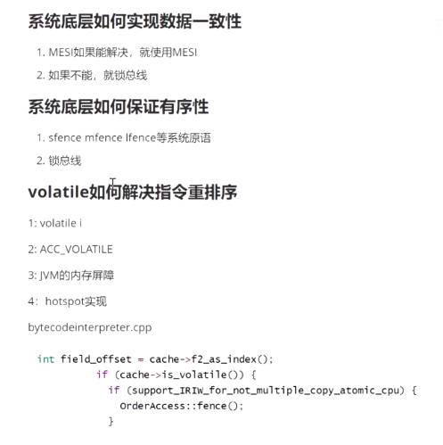

#### 超线程
> 一个ALU对应多个PC
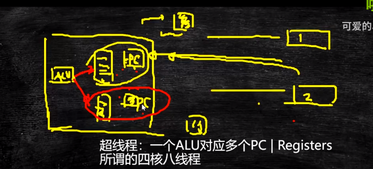

### Cache Line
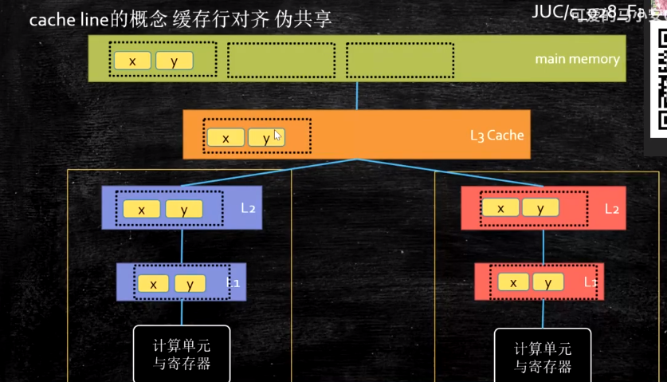

### 常见问题

* 1、DCL(Double Check Lock) 到底需不需要Volatile关键字?
> 答案: 需要。

> 原因对象创建分成三步:1.申请内存 2.设置默认初始值 3、建立关联。
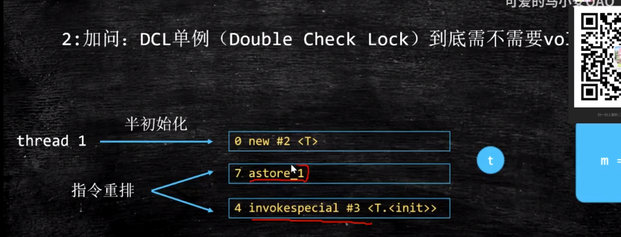
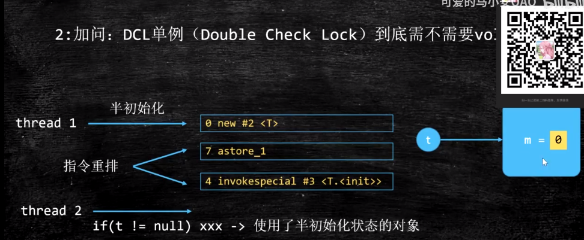

#### 内存屏障概念
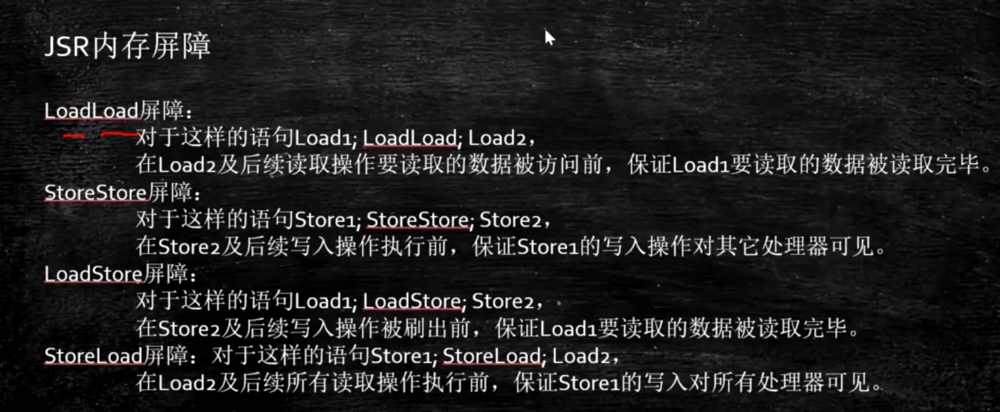

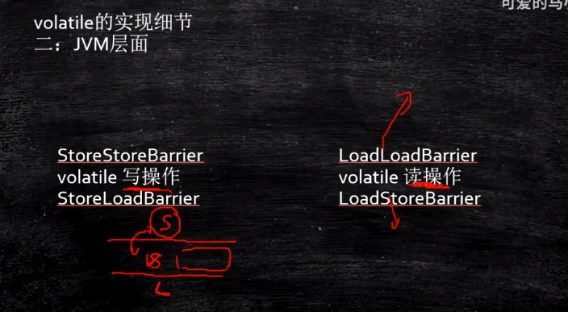

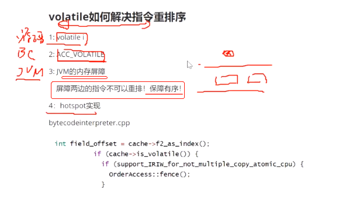

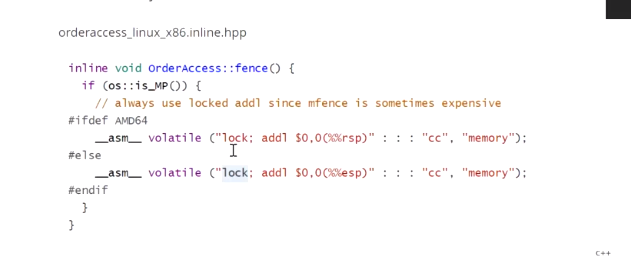

#### 强引用

#### 软引用
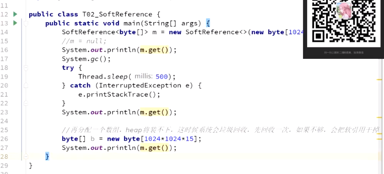

#### 弱引用
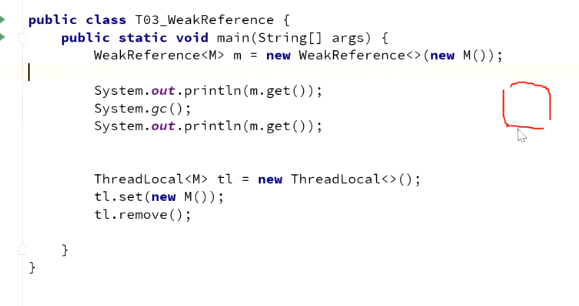

#### 虚引用
* 作用:管理对外内存
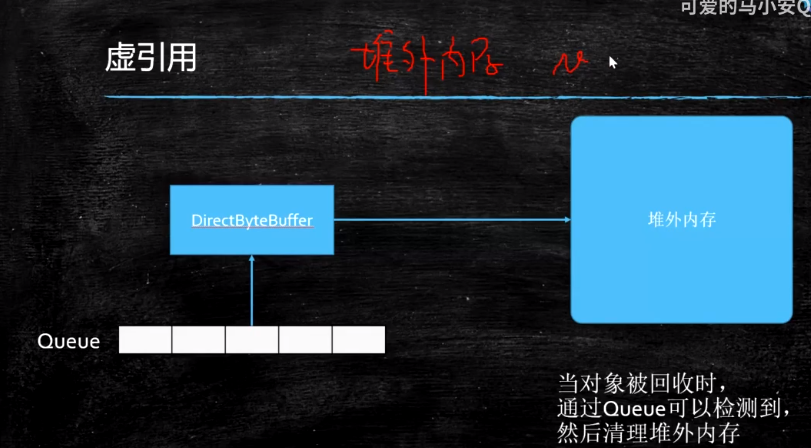
  
##### P8