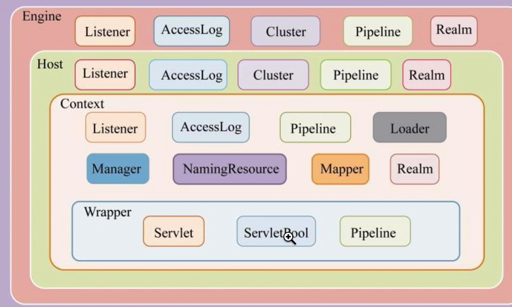

### Tomcat章节
###### 常见问题
* 1、Tomcat整体架构和流程处理解析。
* 2、Tomcat中关于长链接的底层原理和源码实现。
* 3、Tomcat中自定义类加载器的使用和源码实现。
* 4、Tomcat请求处理详解。
* 5、Tomcat启动过程。
* 6、Tomcat中Session功能的实现。

###### 整体架构
* Pipeline List(Value)
* Engine List(Host)
* Host List(Context)
* Context List(Wrapper)
* Wrapper List(Servlet)

